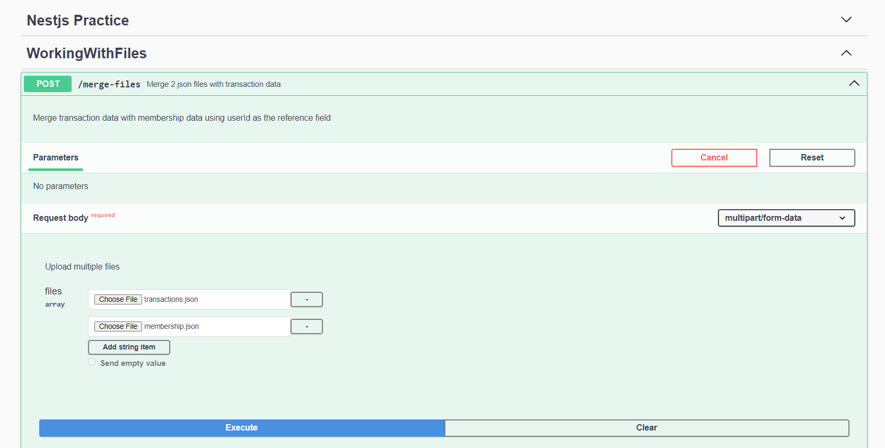
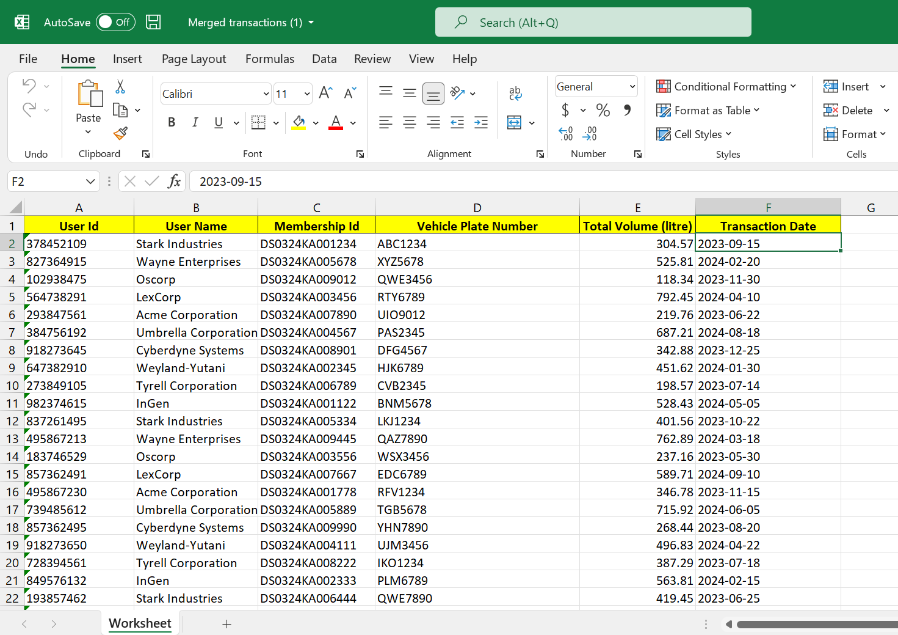

# How to run
- First, clone this repository.
- Run `npm install --save` 
- Run `npm run build`
- Run `npm run start`
- Go to `http://localhost:3000/api`

You'll see the swagger UI to interact with the endpoint.

Now click `Try it out` and upload 2 files.

Run `Execute`

Then click `Download file` in the response area.

# Sample files
See the samples folder
!! Make sure to input the files in order: transaction file -> membership file